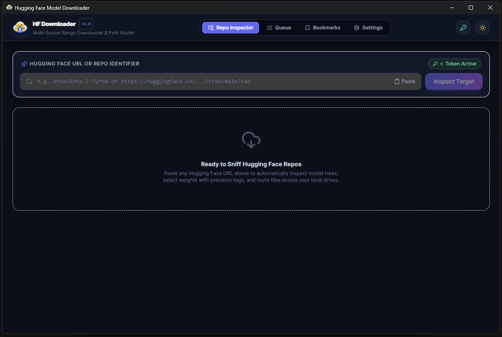
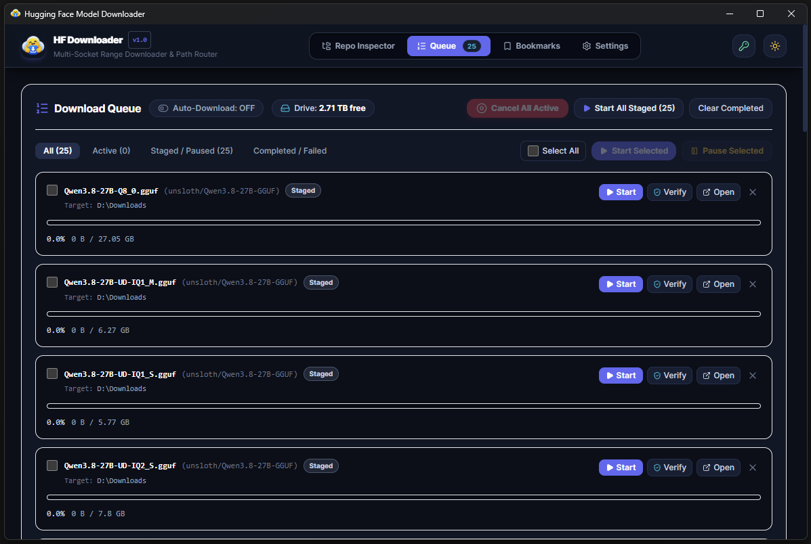
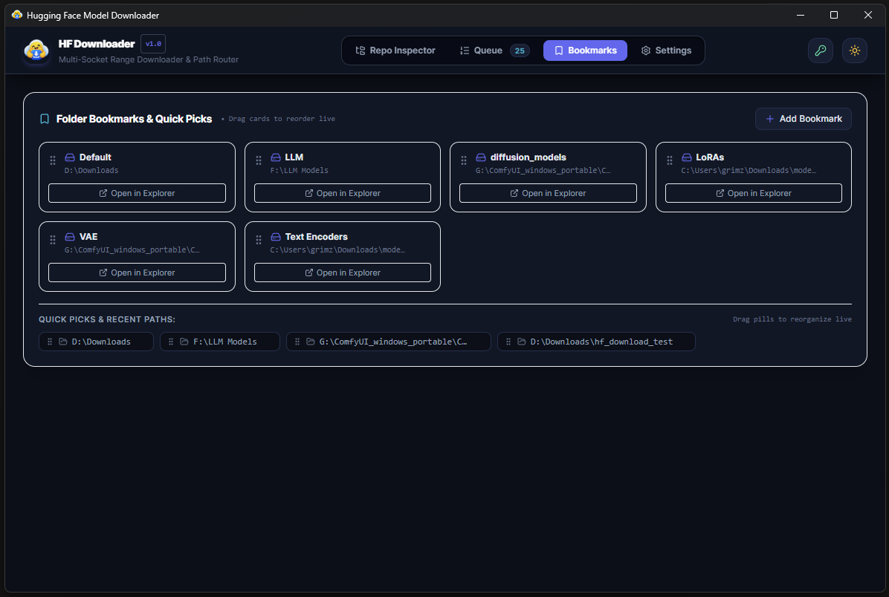
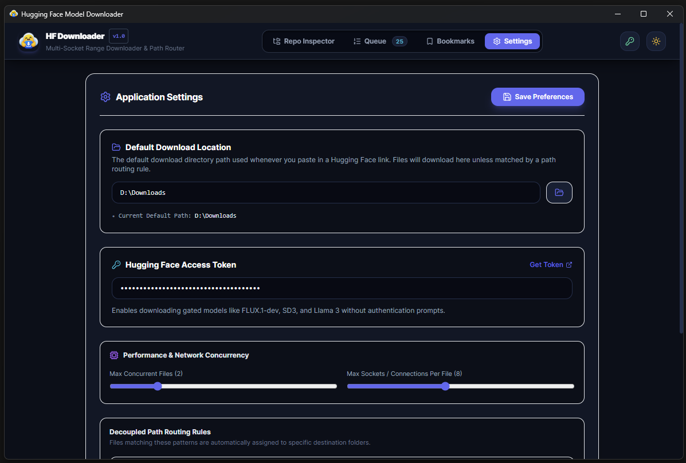

# Hugging Face Desktop Model Downloader

A high-performance, single-binary cross-platform desktop application built with **Go 1.22+** and **Wails v2**, designed specifically for local AI practitioners, ComfyUI users, and LLM enthusiasts.

Easily inspect model repositories, select specific quantized weights or split files, route model types to separate storage drives, and download with multi-socket segmented range transfers and cryptographic verification.

# Why build this?
Hugging Face transitioned toward Xet-based storage infrastructure, bringing major backend advantages like deduplication, smarter file chunking, and content hash-checking. The catch? Browser-based downloads remain notoriously sluggish, prone to stalling, and rarely resume cleanly when a connection drops mid-gigabyte on massive files.

The definitive fix is using the official Hugging Face CLI. It saturates your bandwidth with parallel chunk streaming, resumes interrupted transfers automatically, and validates file integrity on the fly. However, constructing and copy-pasting command-line arguments can still be a friction point. This app was built as a lightweight GUI over the Hugging Face CLI to eliminate that friction entirely.


## 📸 Interface Screenshots

| 🔍 **Repo Inspector** | 📋 **Download Queue** |
| :---: | :---: |
| <a href="example/example_1.png"></a> | <a href="example/example_3.png"></a> |
| *Inspect Hugging Face repos, filter files by precision, and route targets* | *Manage live transfers, track speed/ETA, and execute batch controls* |
| 🔖 **Folder Bookmarks & Quick Picks** | ⚙️ **Application Settings** |
| <a href="example/example_4.png"></a> | <a href="example/example_2.png"></a> |
| *One-click destination cards for ComfyUI, checkpoints, and LoRAs* | *Configure default folders, HF access tokens, and socket concurrency* |

---

## Key Features

### 🔍 Smart URL & Repo Sniffer
- **Versatile Input Parsing**: Paste repository identifiers (`owner/model`), branch/tree URLs (`https://huggingface.co/.../tree/main/...`), blob URLs, or direct download links.
- **Interactive Tree Inspection**: Fetches repository structures dynamically via Hugging Face APIs, displaying precise file sizes, Git LFS metadata, and remote SHA-256 digests.
- **Smart Filtering & Search**:
  - Filter by category pills: Checkpoints, SafeTensors, GGUF, LoRA, VAE, Configs, Text Encoders, Tokenizers, and more.
  - Filter by precision tags: `fp16`, `bf16`, `fp8`, `q4_k_m`, `q8_0`, etc.
  - Live keyword search across filenames and subpaths.
- **Sortable File Table**: Sort by file name or size with convenient batch selection.

### ⚡ Multi-Socket Segmented Range Downloader
- **Parallel Chunked Transfers**: Accelerates downloads using parallel HTTP `Range` requests across configurable sockets per download.
- **Transfer Concurrency Control**: Set maximum simultaneous downloads and socket connections to optimize network bandwidth.
- **Resumable Downloads**: Automatically resumes interrupted or paused downloads from the last saved byte range.
- **Live Transfer Metrics**: Displays real-time speed calculation, dynamic ETA, downloaded byte counts, and aggregate transfer speed.

### 🔀 Decoupled Path Routing & Storage Safeguards
- **Multi-Drive Destination Routing**: Route individual files or model categories to different target directories or physical drives (e.g., checkpoints to `D:\models\checkpoints`, LoRAs to `E:\models\loras`, VAEs to `D:\models\vae`).
- **Batch Destination Router**: Easily configure multiple destination directories simultaneously before initiating downloads.
- **Drive Space Pre-Check**: Checks available disk capacity on target volumes prior to starting downloads, preventing disk overflow errors.

### 📋 Download Queue & Batch Management
- **Queue or Immediate Download**: Choose between staging items in the queue (`Queue Selected`) or immediate download (`Download Now`).
- **Categorized Queue Views**: Filter downloads by **All**, **Active**, **Queued / Paused**, or **Completed / Failed**.
- **Batch Operations**: Master Select-All checkbox, **Start Selected**, **Pause Selected**, **Start All Queued**, and a prominent **Cancel All Active** button.
- **Per-Task Controls**: Start, pause, resume, retry failed items, and open the containing folder directly in Windows Explorer.

### 🛡️ Cryptographic Hash Verification (SHA-256)
- **Automatic & On-Demand Verification**: Computes SHA-256 checksums locally and compares them against official Hugging Face LFS hashes.
- **Dedicated Verification Modal**: Displays detailed visual confirmation of local vs expected SHA-256 digests.
- **SHA-256 Transparency**: Displays expected remote SHA-256 hashes directly on download cards and inspection views.

### 🔖 Folder Bookmarks & Path Management
- **Quick-Pick Presets**: Built-in folder bookmarks optimized for common AI workflows (ComfyUI models, LoRA directories, LLM weights).
- **Recent Paths History**: Keeps track of recently used destination directories with quick removal.
- **Default Directory Configuration**: Configure global default download locations with a native folder browser dialog in Settings.

### ⚙️ Application Settings & Network Controls
- **Windows Explorer Folder Picker**: Configure the global default download location via a dedicated file dialog button.
- **Hugging Face Access Token**: Securely store user access tokens (`hf_...`) to access gated models such as FLUX.1-dev, SD3, and Llama 3 without authentication prompts.
- **Performance Tuning**: Adjust sliders for **Max Concurrent Files** and **Max Sockets / Connections Per File**.
- **Persistent Preferences**: Settings are automatically saved across sessions.

### 🎨 Modern, Responsive Desktop Experience
- Built with **Svelte 5**, **Tailwind CSS**, and **Lucide Icons**.
- Smooth transitions, responsive layouts, and full **Dark / Light theme** support.

---

## Tech Stack

- **Backend**: [Go 1.22+](https://go.dev/) & [Wails v2](https://wails.io/)
- **Frontend**: [Svelte 5](https://svelte.dev/), [TypeScript](https://www.typescriptlang.org/), [Vite](https://vitejs.dev/), [Tailwind CSS](https://tailwindcss.com/)
- **Icons**: [Lucide Svelte](https://lucide.dev/)

---

## Getting Started

### Prerequisites
- **Go**: 1.22 or higher
- **Node.js**: 18 or higher (with `npm`)
- **Wails CLI**: Install via Go:
  ```bash
  go install github.com/wailsapp/wails/v2/cmd/wails@latest
  ```

### Development
Run the application in live-reload development mode:
```bash
wails dev
```

### Building for Production
Create an optimized production binary:
```bash
wails build
```
The compiled single executable will be located in the `build/bin/` directory.

---

## License

Distributed under the MIT License. See [LICENSE](LICENSE) for details.
